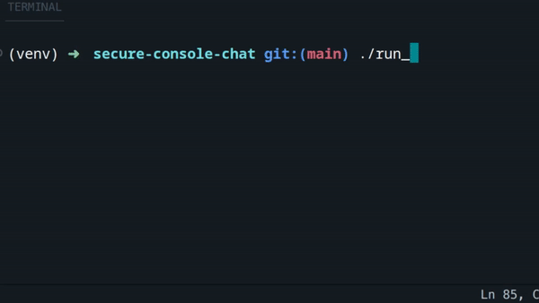

```
 ██████╗███╗   ███╗██████╗  ██████╗██╗  ██╗ █████╗ ████████╗
██╔════╝████╗ ████║██╔══██╗██╔════╝██║  ██║██╔══██╗╚══██╔══╝
██║     ██╔████╔██║██║  ██║██║     ███████║███████║   ██║   
██║     ██║╚██╔╝██║██║  ██║██║     ██╔══██║██╔══██║   ██║   
╚██████╗██║ ╚═╝ ██║██████╔╝╚██████╗██║  ██║██║  ██║   ██║   
 ╚═════╝╚═╝     ╚═╝╚═════╝  ╚═════╝╚═╝  ╚═╝╚═╝  ╚═╝   ╚═╝                                            
```



# What is this?

It is console chat with encrypting your messages

# How it works?

All you need it's to run web-server and connect to them via client

# Run 

### Create and activate virtual environment python

```
pip install secured_console_chat
```

```
import asyncio 

from secured_console_chat import run 

asyncio.run(
    run()
)
```

# How crypting works? 

* Client making priv key
* Server making symmetric key 
* Client sending public key to server
* Server crypting symmetric key and sending to client 
* Client encrypting private key 
* And than communicate with server via symmetric key
