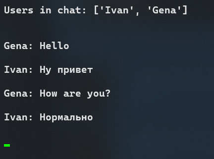

here is secured online chat what can be runned in cmd 

how to run server on windows 10 / 11 in powershell

* python -m venv venv
* venv/scripts/Activate
* pip install -r reqs.txt 
* sanic server.app -H 0.0.0.0 -p 80

how to run clear client

* python -m venv venv
* venv/scripts/Activate
* pip install -r reqs.txt 
* python client.py

crypting pipeline

* Client making priv key
* Server making symmetric key 
* Client sending public key to server
* Server crypting symmetric key and sending to client 
* Client encrypting private key 
* And than communicate with server via
* symmetric key

to do

* interface for choosing server in client 
* double password user verification
* white list